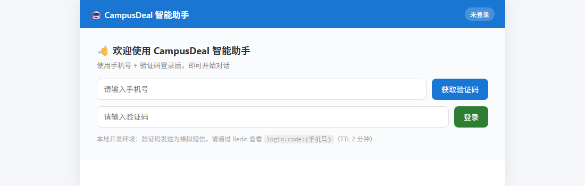
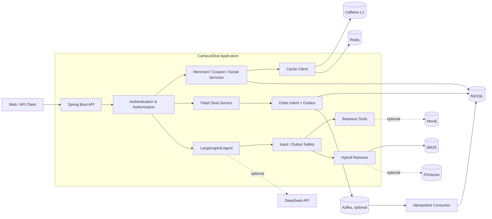

# CampusDeal · 校园生活服务平台

[](https://github.com/senyuLian/campusdeal/actions/workflows/ci.yml)
[](https://openjdk.org/projects/jdk/17/)
[](https://spring.io/projects/spring-boot)
[](LICENSE)

CampusDeal 是一个面向高校场景的 O2O 平台，覆盖商户发现、优惠券闪购、校园社交和 AI 智能客服。项目重点解决高并发秒杀中的可靠受理与最终一致性、Redis 缓存一致性、Agent 会话与输出安全，以及 BM25/PGVector 混合检索问题。

> 这是本人独立完成的个人项目；产品设计、系统架构、后端实现、AI 能力接入、测试、性能验证和运维文档均由本人负责。



## 核心能力

| 模块 | 实现 |
|---|---|
| 商户与缓存 | Redis GEO、Caffeine + Redis 多级缓存、逻辑过期、空值缓存、事务提交后失效 |
| 秒杀与订单 | MySQL 条件扣减、Redis 临时预占、订单意图、Outbox、Kafka 重试/DLT、故障恢复与对账 |
| 社交 | 帖子、持久化点赞/关注关系、幂等写入、复合游标 Feed、计数与 Redis 镜像修复 |
| AI Agent | LangGraph4j ReAct、6 个业务工具、SSE、安全确认、会话隔离、超时与断开取消 |
| RAG | 规范化 passage、BM25 + 可选 PGVector、RRF 融合、文档多样性与降级运行 |
| 安全与运维 | 服务层鉴权、DTO 校验、OTP 原子消费、敏感日志脱敏、Actuator 健康与可靠性指标 |

## 系统架构



秒杀请求只有在 MySQL 事务提交订单意图和 Outbox 后才返回“已受理”。Kafka 不可用时，Outbox 和恢复调度器继续推进订单；Redis 状态丢失时，以数据库库存、订单意图和已完成订单重建准入状态。

## 技术栈

- Java 17、Spring Boot 3.1.10、MyBatis-Plus、MySQL 8
- Redis、Redisson、Caffeine、Lua
- Kafka、Outbox、Canal（可选）
- LangGraph4j、LangChain4j、DeepSeek API
- BM25、PGVector（可选）、Neo4j（可选）
- Flyway、Micrometer、Actuator、JUnit 5、Testcontainers

## 快速开始

推荐使用 Docker Compose。基础环境只启动应用、MySQL 和 Redis；Kafka、Canal、PGVector、Neo4j 与 DeepSeek 默认关闭，不影响核心业务启动。

```bash
git clone https://github.com/senyuLian/campusdeal.git
cd campusdeal
cp .env.example .env
docker compose up --build
```

Windows PowerShell 使用：

```powershell
Copy-Item .env.example .env
docker compose up --build
```

启动完成后访问：

- 智能助手页面：<http://localhost:8081/chat.html>
- 健康检查：<http://localhost:8081/actuator/health>

停止并保留数据：`docker compose down`。删除本地容器数据：`docker compose down -v`。

### 本地 Maven 运行

1. 使用 JDK 17。
2. 启动 MySQL 8 和 Redis。
3. 复制 `.env.example` 中的变量到当前终端或 IDE Run Configuration。
4. 将 `CAMPUSDEAL_FLYWAY_ENABLED` 设为 `true`，由 Flyway 初始化空数据库。
5. 执行 `mvn spring-boot:run`。

`src/main/resources/db/campusdeal.sql` 保留为演示数据快照；新环境的结构初始化以 `src/main/resources/db/migration/` 中的 Flyway 迁移为准。

### 关键环境变量

| 变量 | 用途 | 基础环境是否必需 |
|---|---|---|
| `CAMPUSDEAL_DB_URL` | MySQL JDBC URL | 是 |
| `CAMPUSDEAL_DB_USERNAME` / `CAMPUSDEAL_DB_PASSWORD` | MySQL 凭据 | 是 |
| `CAMPUSDEAL_REDIS_HOST` / `CAMPUSDEAL_REDIS_PASSWORD` | Redis 连接 | 是 |
| `CAMPUSDEAL_FLYWAY_ENABLED` | 启用数据库迁移 | 推荐 |
| `CAMPUSDEAL_KAFKA_ENABLED` | 启用 Kafka 生产、消费与 DLT | 否 |
| `CAMPUSDEAL_DEEPSEEK_API_KEY` | 启用真实 Agent 模型调用 | 否 |
| `CAMPUSDEAL_PGVECTOR_ENABLED` | 启用向量检索 | 否 |
| `CAMPUSDEAL_NEO4J_ENABLED` | 启用知识图谱工具 | 否 |

完整示例见 [.env.example](.env.example)；生产环境会校验已启用集成所需的配置，但不会打印配置值。

## 主要接口

| 模块 | 路径 | 说明 |
|---|---|---|
| 用户 | `/user/code`、`/user/login`、`/user/me` | 验证码登录与 Redis Token |
| 商户 | `/merchant/**`、`/merchant-type/**` | 详情、检索与 GEO 附近商户 |
| 优惠券 | `/coupon/**` | 普通券与闪购券 |
| 秒杀 | `/coupon-order/seckill/{dealId}` | 返回字符串订单 ID 与受理状态 |
| 订单 | `/coupon-order/{orderId}` | 查询 `ACCEPTED/PROCESSING/SUCCEEDED/FAILED` |
| 社交 | `/post/**`、`/follow/**` | 发布、点赞、关注与 Feed |
| Agent | `/agent/chat`、`/agent/confirm` | SSE 对话与敏感操作确认 |
| 上传 | `/upload/post`、`/upload/delete` | 内容检测、资源归属与安全删除 |

SSE 事件协议：`thinking / tool_call / tool_result / confirm / chunk / done / error`。

## 测试状态

当前主分支的可重复验证口径如下：

| 门禁 | 最近结果 | 说明 |
|---|---|---|
| `mvn -B test` | 246/246 通过 | 不依赖外部服务 |
| `mvn -B verify` | BUILD SUCCESS | 默认执行单元测试；4 个外部集成用例未启用时会跳过 |
| OpenSpec 严格校验 | 通过 | 51/64 项具有实现与本地证据 |
| 外部集成门禁 | 待执行 | 需要 Docker/真实 MySQL、Redis、Kafka、PostgreSQL |

启用外部集成测试：

```bash
CAMPUSDEAL_RUN_INTEGRATION=true mvn -B verify
```

历史运行时压测曾取得秒杀成功路径 P99 54 ms、商户缓存 P99 4 ms、峰值生产约 1374 TPS、消费者约 1200 TPS。这些结果属于特定本机环境的历史基准，不替代当前提交的外部集成门禁。测试证据和适用边界见 [测试报告](doc/test-reports/README.md)。

## 设计取舍与当前边界

- 本地验证码为模拟短信，生产接入需替换为真实短信供应商。
- Kafka、Canal、PGVector、Neo4j 和模型调用采用显式开关；基础模式可以独立运行。
- 目前 246 个单元测试已通过；最新外部集成门禁尚未在本机执行，因此相关 OpenSpec 项保持未完成。
- 旧同步秒杀路径仅作为受控回退，默认使用可恢复订单意图链路。

## 项目结构

```text
src/main/java/com/campusdeal
├── controller/     HTTP/SSE 接口
├── service/        业务服务、订单意图、DLT 重放
├── mq/             Kafka、Outbox、故障恢复与对账
├── cache/          Bloom Filter 与本地缓存
├── canal/          Binlog 事件与缓存失效
├── agent/          LangGraph4j Agent、会话与工具注册
├── rag/            文档、BM25、PGVector、RRF 与重建
├── security/       权限、输入输出安全、确认与脱敏
└── config/         Spring、健康检查与可靠性指标
```

## 文档

- [架构与实现方案](doc/final-plan.md)
- [安全与可靠性审查整改记录](doc/project-review-2026-09-19.md)
- [当前修复回归报告](doc/test-reports/13-remediation.md)
- [可靠性运行手册](doc/runbooks/reliability.md)
- [OpenSpec 任务清单](openspec/changes/remediate-project-review-findings/tasks.md)

## License

[MIT](LICENSE) © 2026 senyuLian
